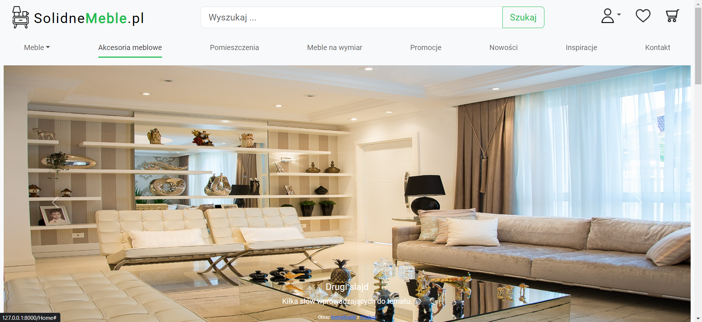
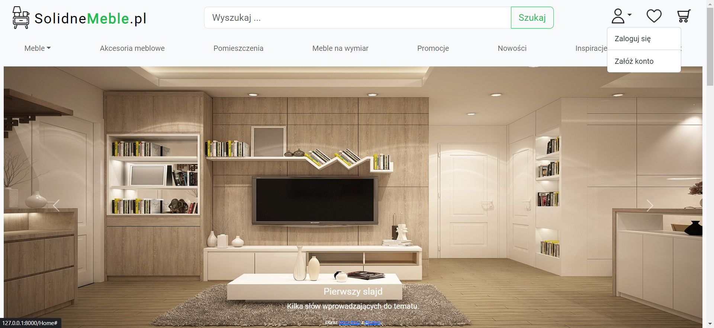

# Furniture store - web store

The project is created as part of training and expanding knowledge about Django and web development in general. This is the final project summarizing my participation in the course.

## Table of Contents
* [Technologies Used](#technologies-used)
* [Features](#features)
* [Screenshots](#screenshots)
* [Setup](#setup)
* [Project Status](#project-status)
* [Room for Improvement](#room-for-improvement)
* [Acknowledgements](#acknowledgements)
* [Contact](#contact)

## Technologies Used
- Python
- Django
- SQLite
- Bootstrap

## Features
- Registration
- Login

## Screenshots

## Setup
Project requirements/dependencies are listed in the [requirements.txt](requirements.txt) file.

## Project Status
Project is:  _in progress_ 

## Room for Improvement
Room for improvement:
- Change all built-in texts for the user to Polish
- Improve the readability of forms

To do:
- Add CRUD for Orders
- Add searching
- Add fitering
- Add email subscriptions

## Acknowledgements
- This project was inspired among others by [meble.pl](https://www.meble.pl/)
- Cookies bar was borrowed from [skrypt-cookies.pl](https://skrypt-cookies.pl/ciasteczka-darmowy-skrypt-na-strone-www)
- This README was inspired by [@flynerdpl](https://www.flynerd.pl/) 
- This README was based on [README-cheatsheet](https://github.com/ritaly/README-cheatsheet/blob/master/README.md?plain=1)

## Contact
Created by [Richard9306](https://github.com/Richard9306) - feel free to contact me!
